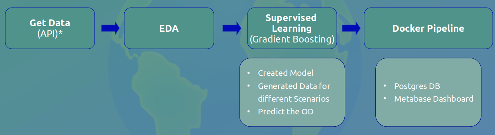

# Prediction of the Earth Overshoot Day for upcoming years taking different scenarios into account 



## Description
In this project the Earth Overshoot Day for upcoming years based on Data from the Global Footprint Network is prdicted. The Data is requested via an API from the Open Data Platform from the Global Footprint Network and saved as JSON-file. After the **Data Visualization** (eda) of the world and EU deficit a **Supervised Learning Model** (**Gradient Boosting**) is used to predict the Overshoot Day in the future for different scenarios. Generating different scenarios ```ML_SupervisedL_LinReg/scenarios.py``` can be used and the factors for the increase/decrease development can be changed. The Results of the predictions will be saved as csv-files and can be presented on a dashboard on **metabase** using **Docker**.

***Notes***: this repo requires you to have your own API keys for https://data.footprintnetwork.org/#/. You'll also need to have docker up and running on your machine.


## Usage
1. Install Docker: https://docs.docker.com/get-docker/ (if it is not already running on your machine)
2. Clone this repo
3. Enter you API KEY in the ```config_example.py```
4. You can change the Environment Variables for the PostGreSQL
5. For Information about the data and definitions check ```https://www.footprintnetwork.org/resources/glossary/```
6. For the Data Visualization of the world deficit use ```eda/eda_defict_world.py```
7. For predicting the OD (Overshoot Day) first ```ML_SupervisedL_LinReg/scenario01.py``` has to be executed followed by ```ML_SupervisedL_LinReg/scenarios.py```. Here different scenarios can be created by changing the factors of the functions and store the DataFrame as diffrent files to display them on metabase.
4. Go to the `dashboard` folder of the project in the terminal and run docker-compose build && docker-compose up
5. In your browser open ```http://localhost:3000/``` to create a metabase

